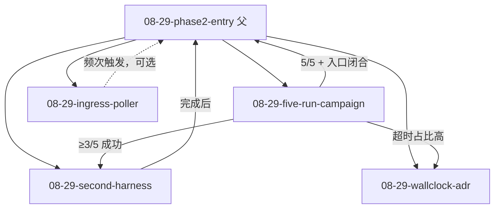

# 阶段二入口验证 · 技术设计

## 任务树与依赖



依赖**写在子任务 prd/implement.md**，树位置不隐含顺序。

## 阶段二触发清单（§4.1）

| 条件 | 验证方式 | 负责子任务 |
|---|---|---|
| v0.1 判据 | 已闭合（归档 prd + main） | — |
| 连续 5 Task 无人工 | JSONL + prd 表格 | five-run-campaign |
| 事件流四问 | `keel status --events` + ContextBuilt 抽样 | five-run-campaign |
| ADR-0003 Accepted | 已 Accepted | — |
| ADR-0005 后果（第二 Harness） | Claude Code 验收 | second-harness |

## 五连度量 schema（JSONL 每行）

```json
{
  "run": 1,
  "issue_url": "https://github.com/.../issues/N",
  "task_id": "uuid",
  "final_status": "S-DONE",
  "transitions": ["T-001", "..."],
  "pr_url": "https://github.com/.../pull/N",
  "ci_verified": true,
  "duration_s": 140,
  "human_intervention": false,
  "failure_class": null
}
```

`failure_class` 枚举：`policy` | `timeout` | `ci` | `infra` | `model` | null

## 凭据与环境（继承 v0.1 验收）

见 `.trellis/spec/backend/quality-guidelines.md` §验收测试的凭据：

- `KEEL_GITHUB_TOKEN`（ghp_ PAT，非 ghs_）
- `OPENCODE_API_KEY` 或 `DEEPSEEK_API_KEY`
- `KEEL_TEST_REMOTE_REPO`
- `omp` CLI + `preflight.ts`

## 边界

- 父任务不产生 `src/` 变更
- 子任务各自 branch + PR，按 Trellis 惯例 `task.py set-branch`
